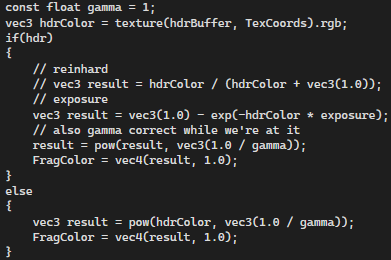

Github Link - https://github.com/StephenMartin2410/COMP3015-CW2.git

Youtube Link - 

# COMP3015 Coursework 2
## Visual Studio Community 2022 Version 17.8.0
## Windows 11 Pro Version 23H2 OS build 22631.3296

#How does it work?
In this program the user can use keyboard controls to control the position of the camera.
- W and S move the camera forward and backwards.
- The arrow keys move the camera angle around.

##  Features of the Application -

- HDR with tone mapping
This feature is used to allow brightness and colour values shown in a seen to go over the default maximum allowed value of 1.0. The HDR works by rendering the inital framebuffer with a colour buffer which can exceed 1.0. Then the colour buffer of the framebuffer is rendered to a screen sized quad. The program then uses tone mapping to ensure that when transforming the quad back into an outputtable buffer. Reinhard tone mapping is used to divide all of the HDR values into standard values. Tone mapping is also used to set the exposure of the scene so that the exposure is variable and can change how the HDR interacts with the detail of the scene.

- Noise
  - Disintegration 
  This form of noise is used to remove parts of the disintegration plane in the scene. The rendered noise is used to discard the parts of noise that are generated on the plane.
  - Paint Splatter 
  This form of noise is used to paint parts of the paint splatter plane that have noise. 
  - Cloud effect
This feature works by mixing the colours white and blue with a noise texture to make a plane look like a set of clouds.

- Keyboard movement 
The W and S keys are used in the scene to move forwards and backwards and then the arrow keys can be used to transform the angle of the camera.

## Implementation - 
- Scenebasic_uniform.cpp
  This is the main hangout for all of the code for the program. 

  The first function is initScene, which is used to load in the texture for the model, load the position of the multiple lights from CW1, creating the colour buffer for the HDR implementation as well as attaching the colour buffer to the framebuffer of the program. 

  The second function is compile, which is used to link all of the shaders of the program together and initialise them for use.

  The third function is render. This function is used to show the material effects from CW1, set the inital camera position for the player to move, and then the function is used to set and render the position of the noise planes. It is also used to create the quad used in HDR.

  The next function is setMatrices, which is used to set the view matrix of the program to model view projection.

  The last two functions, inputRotate and input Movement, are used to take the input from scenerunner.h and use the functions to move the camera position and angle as the user presses W, S and the arrow keys.

- basic_uniform_vert
  This is the standard vertex shader for the program.

- basic_uniform.frag
  This is the standard fragment shader for the program. This is used to set the lighting information and the material information.

  The function used in this fragment shader is the phongModel function, which is used to set the specification of the lighting and set the specular lighting from CW1.

- shader_uniform.vert
  This is the vertex shader for the HDR functionality of the program. 

- shader_uniform.frag 
  This is the fragment shader used for the HDR parts of the program. This file uses the value of exposure, gamma and the hdr buffer to give the scene the correct colour values to be able to display HDR. 

- noise_uniform.vert
This is the vertex shader for the noise functionality of the program.

- noise_uniform.frag
  This is the fragment shader for the noise functionality of the program.

  The first function is phongModel, which is meant to be able to allow the planes outputted with the shader to show specular light but it doesn't seem to do much.

  The main of this file is used to show the calculations/statements that control the disintegration noise, the paint noise and finally the cloud noise. All of these statements work in very similar way which can be seen by using the same noise, the disintegration discards the sections covered by noise, the paint colours the noise and the clouds and used as its own noise and then the pattern is controlled by mixing the colours of blue and white. 

All of the shaders are separated in this program so that they don't interfere with each others different functions, there is the basic shaders, noise shaders and then the HDR shaders.

All of these files and the given helper files in the labs are used to create the prototype for my CW2 demo.
